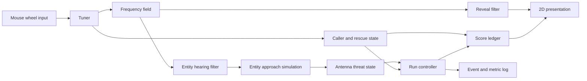

# Technical Design

## Decisions
DEC-001: Status=accepted; provenance=user brief; source=REQ-001; choose an engine-neutral 2D PC score-attack boundary with emergency-radio input and supernatural-storm presentation supports REQ-001 because the 2D PC score-attack emergency-radio storm subjects are direct brief terms and no engine is selected.
DEC-002: Status=accepted; provenance=user brief; source=REQ-002; route mouse-wheel deltas through a tuning-dial command and gate the actionable arena view on the first tuning command supports REQ-002 because the mouse-wheel tuning-dial gate implements the invisible arena prerequisite.
DEC-003: Status=accepted; provenance=user brief; source=REQ-003; represent hazards, stranded callers, and safe routes as frequency-tagged revealables queried by the current frequency supports REQ-003 because frequency-tagged revealables repeat and implement the hazards, stranded callers, and safe routes subjects.
DEC-004: Status=accepted; provenance=user brief; source=REQ-004; give entities frequency-dependent hearing eligibility and station-approach state supports REQ-004 because entity hearing eligibility and station approach implement tuning-dependent hearing and approach.
DEC-005: Status=accepted; provenance=user brief; source=REQ-005; implement scan, identify, hold, guide-home, retune, and hostile-interference avoidance as explicit session states and ordered events supports REQ-005 because the explicit states repeat every subject in the scan-identify-hold-guide-retune loop.
DEC-006: Status=provisional; provenance=brief plus non-authoritative inference; source=REQ-006 and ASM-003; store 300 seconds as a configurable nominal run target while keeping OQ-005 open supports REQ-006 because the configurable 300-second run target represents five minutes without inventing the duration tolerance.
DEC-007: Status=accepted boundary; provenance=user brief plus supplied authority limit; source=REQ-007 and ANS-002; record separate rescue, signal-accuracy, and dangerous-band-time score components while leaving relative scoring weights unselected supports REQ-007 because the separate score components implement rescues, signal accuracy, and dangerous-band time without inventing weights.
DEC-008: Status=provisional; provenance=user brief constraint plus non-authoritative inference; source=REQ-008, CON-001, and ASM-002; use one logical scene with waveform, silhouette, static, and layered-sound adapters for the first playable supports REQ-008 because the one-room scene and permitted low-fidelity materials preserve the first-playable scope.
DEC-009: Status=accepted boundary; provenance=user brief plus supplied authority limit; source=REQ-009 and ANS-003; expose hidden-information outcomes and measurement hooks while leaving the intriguing-versus-unfair cutoff unselected supports REQ-009 because hidden-information outcomes permit evaluation without inventing the fairness cutoff.
DEC-010: Status=accepted boundary; provenance=user brief plus supplied answer; source=REQ-010 and ANS-001; maintain an accessibility extension seam but select no captions, equivalent visual channels, defaults, directional indicators, non-colour distinctions, or information-parity rule supports REQ-010 because the undecided deaf or hard-of-hearing support remains visibly unsettled.
DEC-011: Status=provisional; provenance=non-authoritative inference; source=ASM-001 and OQ-008; define domain ports without choosing an engine, language, renderer, audio stack, or packaging toolchain supports REQ-001 because the engine-neutral domain ports keep the 2D PC game implementable while technology authority is absent.
DEC-012: Status=provisional; provenance=non-authoritative inference; source=ASM-004; provide deterministic clocks, seeded scenarios, event logs, and input injection at domain ports supports REQ-002 because deterministic mouse-wheel tuning inputs make the invisible-arena transition objectively testable.
DEC-013: Status=candidate only; provenance=external guidance constrained by supplied answer; source=ANS-001; relevant=EVD-001; retain multi-sensory gameplay-information equivalents as an accessibility option, not settled scope supports REQ-010 because multi-sensory gameplay information concerns deaf or hard-of-hearing support that remains undecided.
DEC-014: Status=candidate only; provenance=external guidance constrained by supplied answer; source=ANS-001; relevant=EVD-002; retain captions and spatial identification as accessibility options, not settled defaults or scope supports REQ-010 because captions and spatial identification concern the undecided deaf or hard-of-hearing support.
DEC-015: Status=accepted boundary; provenance=external guidance plus supplied answer; source=ANS-002; relevant=EVD-006; require stakeholder preference before selecting relative scoring weights supports REQ-007 because scoring weights express preference among rescues, signal accuracy, and dangerous-band time.
DEC-016: Status=candidate method; provenance=external empirical study plus supplied answer; source=ANS-002; relevant=EVD-007; evaluate stakeholder-approved scoring weights through iterative player-performance tests supports REQ-007 because player-performance tests can observe how scoring risk and reward affect the three score components.
DEC-017: Status=accepted boundary; provenance=external standard plus supplied answer; source=ANS-003; relevant=EVD-003; do not infer a hidden-information fairness cutoff from general usability framing supports REQ-009 because context-dependent usability does not select the intriguing-versus-unfair boundary.
DEC-018: Status=candidate method; provenance=external measurement guidance plus supplied answer; source=ANS-003; relevant=EVD-004; combine objective player performance with subjective satisfaction only after a project-specific fairness criterion is authorized supports REQ-009 because performance and satisfaction can measure hidden-information fairness but cannot choose its cutoff.
DEC-019: Status=candidate method; provenance=external validated instrument plus supplied answer; source=ANS-003; relevant=EVD-005; consider a suitable subset or adaptation of video-game satisfaction measurement only after the fairness criterion and playtest protocol are authorized supports REQ-009 because video-game satisfaction measurement may observe player experience without defining intriguing-versus-unfair success.
DEC-020: Status=accepted boundary; provenance=external requirements guidance plus supplied answer; source=ANS-005; relevant=EVD-008; retain a measurable run-duration tolerance placeholder and do not populate it without stakeholder direction supports REQ-006 because a measurable timing tolerance is required to verify “about five minutes” but its value is unresolved.
DEC-021: Status=accepted boundary; provenance=external delivery guidance plus supplied answer; source=ANS-006; relevant=EVD-009; require the first-playable continue-revise-stop evidence boundary to be agreed before evaluative testing supports REQ-009 because advance prototype evidence criteria are needed to judge the hidden-information risk without inventing success.
DEC-022: Status=accepted boundary; provenance=external project guidance plus supplied answer; source=ANS-007; relevant=EVD-010; treat the one-room first-playable statement as an inclusion constraint and infer no complementary exclusion supports REQ-008 because stakeholder-agreed exclusions cannot be derived from the permitted one-room scope.
DEC-023: Status=provisional; provenance=non-authoritative identity inference; source=REQ-008 and CON-001; use an oscilloscope-like waveform, silhouette, static, and restrained storm palette for the first-playable visual system supports REQ-008 because waveform, silhouette, and static treatments directly use the permitted low-fidelity first-playable materials.
DEC-024: Status=provisional; provenance=non-authoritative brand inference; source=REQ-001; use terse civil-defence radio language disrupted by supernatural interference for identity copy supports REQ-001 because civil-defence radio language and supernatural interference repeat the emergency-radio supernatural-storm premise.
DEC-025: Status=provisional; provenance=non-authoritative identity inference; source=REQ-008 and CON-001; use a circular tuning-dial mark crossed by a broken waveform with a caller beacon and a 32-pixel silhouette check supports REQ-008 because the tuning dial, waveform, and silhouette mark use the permitted first-playable radio and abstract presentation subjects.
DEC-026: Status=provisional; provenance=non-authoritative identity inference; source=REQ-001; pair narrow uppercase display lettering with legible monospaced or humanist sans-serif instrument text supports REQ-001 because display lettering and instrument text reinforce the emergency-radio control role while remaining provisional.

## System Shape

The domain layer owns the tuner, frequency field, caller state, entity hearing and approach, antenna threat, run clock, and score ledger. Adapters translate mouse-wheel input, 2D visuals, static and waveform effects, layered sound, local save data, and platform packaging. This separation keeps the design usable before OQ-008 selects technology.

## State Model

The run controller advances through `Unstarted`, `Scanning`, `CallerIdentified`, `SignalHeld`, `RescueComplete`, and `Ended`. Hostile interference is orthogonal: eligible entities may progress from `Unaware` to `Hearing`, `Approaching`, and `AtAntenna` as tuning changes. A retune may revoke hearing eligibility or reveal a new route, so state transitions consume the current frequency rather than caching presentation state.

## Core Data

- `Frequency`: normalized dial value plus band identity.
- `Revealable`: category, spatial form, reveal bands, and presentation handle.
- `Caller`: target frequency, required hold duration, accumulated valid hold, route, and rescue state.
- `Entity`: hearing bands, position, approach speed, and threat state.
- `ScoreLedger`: raw rescues, signal-error samples, dangerous-band milliseconds, and externally supplied weights.
- `RunMetrics`: nominal target, actual duration, ordered events, failures, and optional non-identifying playtest responses under ASM-005.

## Interfaces

`ITuningInput`, `IClock`, `IRandomSource`, and `IScenarioLoader` must be injectable. `IPresentation`, `IAudioOutput`, `IAccessibilityOutput`, `IMetricsSink`, and `ISaveStore` are adapters. `IAccessibilityOutput` is an empty extension seam until OQ-001 is answered; its existence does not settle a feature.

## Verification Hooks

Seeded scenarios expose known reveal bands, hearing bands, caller hold times, and approach paths. A virtual clock permits exact 300-second target inspection without waiting in real time. The ordered event log supports the reveal, entity, loop, duration, and scoring acceptance checks. Any telemetry implementation remains blocked by OQ-009.
