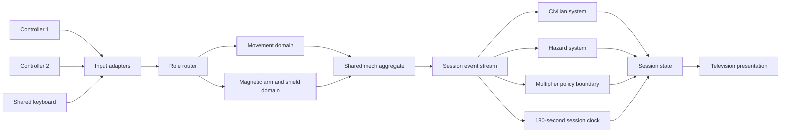

# Technical Design

## System shape

The prototype is modelled as one local session containing one shared mech aggregate. Device adapters convert controller or keyboard signals into semantic actions. A role router assigns the movement domain and tool domain to player slots. Gameplay systems emit domain events into session state; presentation reads that state without owning rules. Content identities and tuning values stay in data so blocked stakeholder choices can be supplied without replacing the session core.

## Runtime flow

1. A lobby binds two player slots to either two controllers or two non-overlapping keyboard groups.
2. Session start creates one block, one mech aggregate, one civilian archetype registry, the approved three-entry hazard catalogue, and a 180-second clock.
3. The role router gives one slot movement and jump actions and the other magnetic-arm and shield actions.
4. A confirmed damage event is reduced once, then atomically exchanges the two role assignments and emits audiovisual feedback.
5. Civilian catches, wreckage throws, hazard contacts, and approved cooperative triggers emit timestamped events.
6. The outcome and multiplier policy boundaries consume events only after OQ-007 and OQ-008 are answered.
7. Timeout freezes gameplay, presents the authorised outcome, and exposes restart; restart constructs a fresh session from the same manifest.

## Boundaries

- `DeviceAdapter` discovers devices and yields semantic actions; it never decides role ownership.
- `RoleRouter` owns player-to-domain assignment and the atomic damage swap.
- `MechAggregate` owns locomotion, jump, magnetic arm, shield, health, and damage confirmation for one entity.
- `BlockDirector` owns scrolling, spawn lanes, content counts, and the single level lifecycle.
- `CivilianSystem` owns falling, caught, rescued, and missed states for one archetype.
- `HazardSystem` owns a three-entry catalogue whose exact entries remain blocked by OQ-006.
- `MultiplierPolicy` and `OutcomePolicy` are interfaces with test doubles until OQ-008 and OQ-007 are answered.
- `PresentationModel` exposes timer, roles, multiplier, civilian state, warnings, damage, and outcomes to television UI and effects.
- `SessionTelemetry` records anonymous local test events only; storage, consent, and retention are delivery choices, not authorised production features.

## Decisions
DEC-001: STATUS: accepted; PROVENANCE TYPE: user brief; SOURCE: REQ-001; the Half-Mech Heroes title is the canonical package and build title; DEC-001 supports REQ-001 because the Half-Mech Heroes title repeats the exact project-title subject and preserves brief authority.
DEC-002: STATUS: accepted; PROVENANCE TYPE: user brief; SOURCE: REQ-002; the local two-player session has exactly two human player slots and no network dependency; DEC-002 supports REQ-002 because two local human player slots implement the local two-player couch arcade game.
DEC-003: STATUS: accepted; PROVENANCE TYPE: user brief; SOURCE: REQ-003; one shared MechAggregate receives both players' semantic actions; DEC-003 supports REQ-003 because the single shared MechAggregate is the same malfunctioning rescue mech operated by both players.
DEC-004: STATUS: accepted; PROVENANCE TYPE: user brief; SOURCE: REQ-004; the MovementDomain contains movement and jumping and defaults to left-side gamepad inputs; DEC-004 supports REQ-004 because the MovementDomain repeats movement and jumping on the gamepad left side.
DEC-005: STATUS: accepted; PROVENANCE TYPE: user brief; SOURCE: REQ-005; the ToolDomain contains magnetic-arm aim and shield use and defaults to right-side gamepad inputs; DEC-005 supports REQ-005 because the ToolDomain repeats magnetic arm and shield on the gamepad right side.
DEC-006: STATUS: accepted; PROVENANCE TYPE: user brief; SOURCE: REQ-006; the RoleRouter atomically exchanges MovementDomain and ToolDomain ownership after each confirmed mech damage event; DEC-006 supports REQ-006 because the confirmed mech damage event causes exactly one automatic role swap.
DEC-007: STATUS: accepted; PROVENANCE TYPE: user brief; SOURCE: REQ-007; BlockDirector maintains one continuously scrolling disaster-zone level instance per attempt; DEC-007 supports REQ-007 because one scrolling level instance repeats the single scrolling disaster-zone subject.
DEC-008: STATUS: accepted; PROVENANCE TYPE: user brief; SOURCE: REQ-008; CivilianSystem implements falling-to-caught and caught-to-rescued state transitions; DEC-008 supports REQ-008 because the falling-to-caught transition implements catching falling civilians.
DEC-009: STATUS: accepted; PROVENANCE TYPE: user brief; SOURCE: REQ-009; magnetic wreckage exposes grab, carry, release, and thrown-clear states; DEC-009 supports REQ-009 because the thrown-clear wreckage state implements throwing wreckage out of the way.
DEC-010: STATUS: provisional-blocked; PROVENANCE TYPE: user brief plus unresolved question; SOURCES: REQ-010 and OQ-008; MultiplierPolicy exposes visible value and event inputs but no trigger, growth, cap, decay, reset, or score formula; DEC-010 supports REQ-010 because the teamwork multiplier boundary preserves the multiplier subject without inventing the unresolved rules.
DEC-011: STATUS: accepted; PROVENANCE TYPE: user-brief constraint; SOURCE: CON-001; SessionClock ends active play at 180 seconds; DEC-011 supports REQ-011 because the 180-second SessionClock is exactly the three-minute rescue attempt.
DEC-012: STATUS: provisional; PROVENANCE TYPE: user brief plus non-authoritative inference; SOURCES: REQ-012 and ASM-002; restart reconstructs a fresh session and targets control restoration within 5.0 seconds; DEC-012 supports REQ-012 because session reconstruction implements quick restarts while the 5.0-second threshold remains an assumption.
DEC-013: STATUS: provisional; PROVENANCE TYPE: user brief plus non-authoritative inference; SOURCES: REQ-013 and ASM-008; exaggerated-physics forces, impulses, damping, and joint limits are data-tunable against the provisional distance, recoil, and recovery markers; DEC-013 supports REQ-013 because tunable forces and the exact provisional markers expose exaggerated physics to objective inspection.
DEC-014: STATUS: accepted; PROVENANCE TYPE: user brief; SOURCE: REQ-014; all gameplay classes require distinct solid-mask silhouettes before surface detail; DEC-014 supports REQ-014 because distinct solid-mask silhouettes operationalise chunky silhouettes.
DEC-015: STATUS: provisional; PROVENANCE TYPE: user brief plus non-authoritative inference; SOURCES: REQ-015 and ASM-004; mechanical failures are tagged, authored event reactions with bounded duration and tunable intensity; DEC-015 supports REQ-015 because tagged failure reactions implement funny mechanical failures without fixing unauthorised tuning.
DEC-016: STATUS: provisional; PROVENANCE TYPE: user brief plus non-authoritative inference; SOURCES: REQ-016 and ASM-003; PresentationModel uses redundant shape, position, motion, icon, and colour cues validated in the provisional television setup; DEC-016 supports REQ-016 because redundant cues and the television setup test television readability.
DEC-017: STATUS: accepted; PROVENANCE TYPE: user brief informed by external guidance; SOURCES: REQ-017 and EVD-006; DeviceAdapter normalises two controllers and one shared keyboard into the same semantic-action schema; DEC-017 supports REQ-017 because the normalised controller and shared-keyboard schema implements both required input configurations.
DEC-018: STATUS: accepted; PROVENANCE TYPE: user-brief constraint; SOURCE: CON-003; ContentManifest validates exactly one city-block entry; DEC-018 supports REQ-018 because the one city-block manifest entry enforces one city block.
DEC-019: STATUS: provisional; PROVENANCE TYPE: user brief plus non-authoritative inference; SOURCES: REQ-021 and ASM-005; the prototype exposes coordinated-action counts and scripted failure triggers for five-dyad discovery tests; DEC-019 supports REQ-021 because coordinated-action improvement and failure reactions test coordination mastery and comedy.
DEC-020: STATUS: accepted; PROVENANCE TYPE: user brief; SOURCE: REQ-022; input-remapping delivery work remains behind an unresolved scope gate; DEC-020 supports REQ-022 because the input-remapping gate preserves input remapping as open.
DEC-021: STATUS: provisional; PROVENANCE TYPE: unresolved question plus non-authoritative inference; SOURCES: OQ-005 and ASM-001; the session core avoids platform-specific release services until a primary platform answer exists; DEC-021 supports ASM-001 because the platform-neutral session core repeats the provisional platform-neutral engineering approach.
DEC-022: STATUS: provisional-blocked; PROVENANCE TYPE: unresolved stakeholder choice informed by advisory external guidance; SOURCES: REQ-024, OQ-003, and EVD-003; DifficultyPolicy remains an unconfigured boundary rather than a selected scaling model; DEC-022 supports REQ-024 because the unconfigured difficulty boundary preserves difficulty scaling as unresolved.
DEC-023: STATUS: provisional-blocked; PROVENANCE TYPE: unresolved stakeholder choice informed by advisory external guidance; SOURCES: REQ-022, OQ-001, and EVD-002; action identifiers are separated from physical inputs but no remapping UI or scope is selected; DEC-023 supports REQ-022 because the action-to-input boundary preserves input remapping as unresolved.
DEC-024: STATUS: accepted; PROVENANCE TYPE: unresolved stakeholder choice informed by classification guidance; SOURCES: REQ-025, OQ-004, and EVD-001; no exact target age or rating proxy is assigned; DEC-024 supports REQ-025 because withholding an exact target age preserves the exact target-age question.
DEC-025: STATUS: provisional-blocked; PROVENANCE TYPE: unresolved stakeholder choice informed by contextual external material; SOURCES: CON-005, OQ-006, and EVD-005; HazardSystem uses an unnamed three-slot catalogue and does not adopt contextual disaster hazards as product authority; DEC-025 supports CON-005 because the unnamed three-slot hazard catalogue preserves three hazards without selecting their identities.
DEC-026: STATUS: provisional-blocked; PROVENANCE TYPE: supplied non-resolution informed by advisory external guidance; SOURCES: ANS-005 and EVD-004; OutcomePolicy requires an explicit visible success condition but contains no quota, score, survival, or other threshold; DEC-026 supports ANS-005 because the empty visible success-condition policy preserves the supplied answer's refusal to invent a success condition.
DEC-027: STATUS: accepted; PROVENANCE TYPE: user brief; SOURCE: REQ-023; no solo mode is included or excluded by this initiation package; DEC-027 supports REQ-023 because withholding a solo-mode choice preserves solo play as unresolved.
DEC-028: STATUS: provisional-blocked; PROVENANCE TYPE: supplied platform non-resolution informed by current first-party delivery documentation; SOURCES: ANS-003 and EVD-007; storefront onboarding, fees, packaging, and release tasks remain outside the prototype baseline until a primary platform is selected; DEC-028 supports ANS-003 because the blocked platform delivery tasks preserve the supplied answer's refusal to select a primary platform.
DEC-029: STATUS: accepted; PROVENANCE TYPE: supplied authority boundary informed by external guidance; SOURCES: ANS-006 and EVD-008; accessibility guidance is treated as advisory design input rather than stakeholder authority; DEC-029 supports ANS-006 because both records preserve stakeholder authority over input-remapping scope despite external accessibility guidance.
DEC-030: STATUS: accepted; PROVENANCE TYPE: user-brief constraint; SOURCE: CON-004; CivilianSystem validates exactly one civilian-type registry entry; DEC-030 supports REQ-019 because the one civilian-type registry entry enforces one civilian type.
DEC-031: STATUS: accepted; PROVENANCE TYPE: user-brief constraint; SOURCE: CON-005; HazardSystem validates exactly three hazard catalogue entries while leaving their identities unset; DEC-031 supports REQ-020 because the three hazard catalogue entries enforce three hazards without selecting their identities.

## Quality gates

- Unit tests cover semantic-action routing, atomic role exchange, timer expiry, state transitions, manifest counts, and clean restart.
- Integration tests run the complete checklist with two controllers and with one shared keyboard.
- Capture-based tests exercise every HUD, role, civilian, hazard, and tagged-failure state in the provisional television setup.
- Dyad sessions use the script and thresholds in AC-021 and record raw observations separately from interpretation.
- Work on blocked policy boundaries begins only after the corresponding OQ record receives a stakeholder-authored answer.
